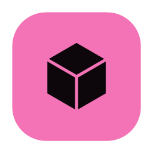
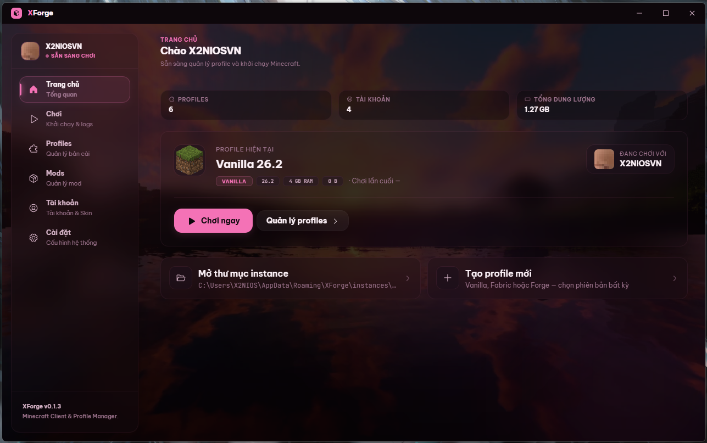
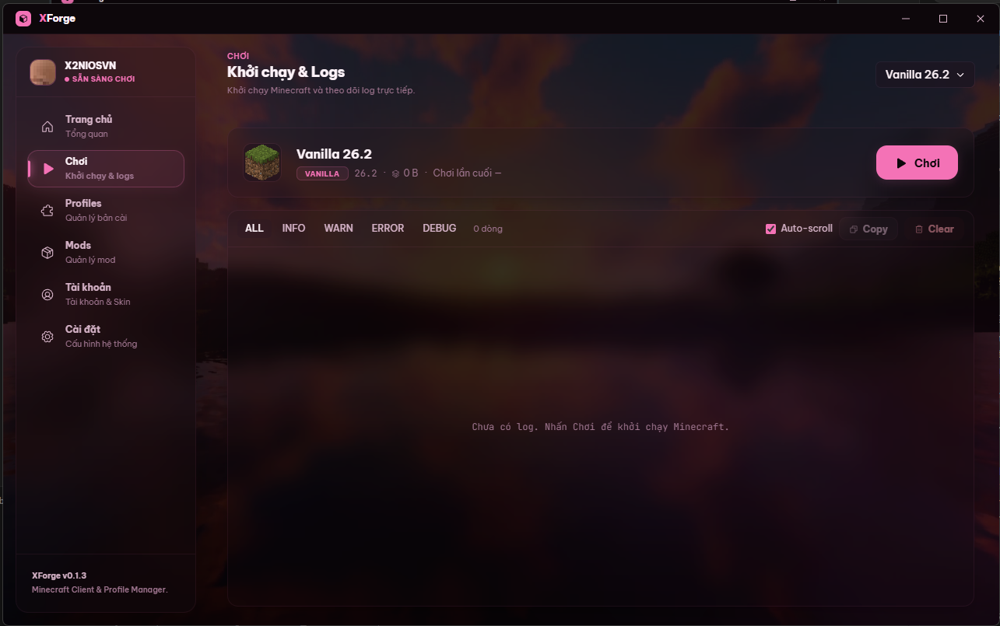
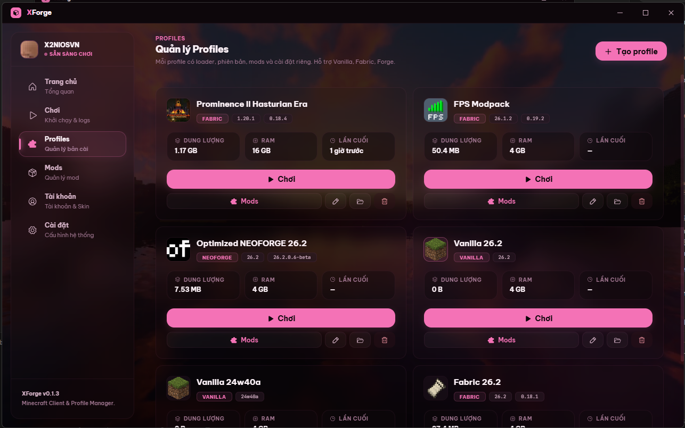
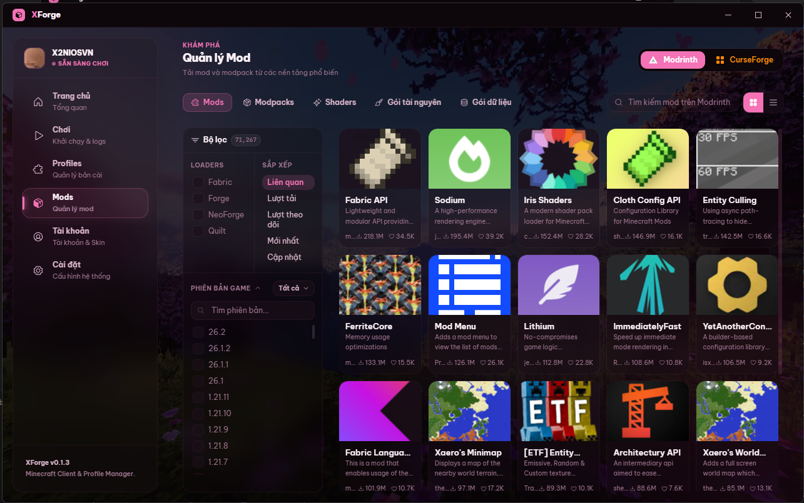
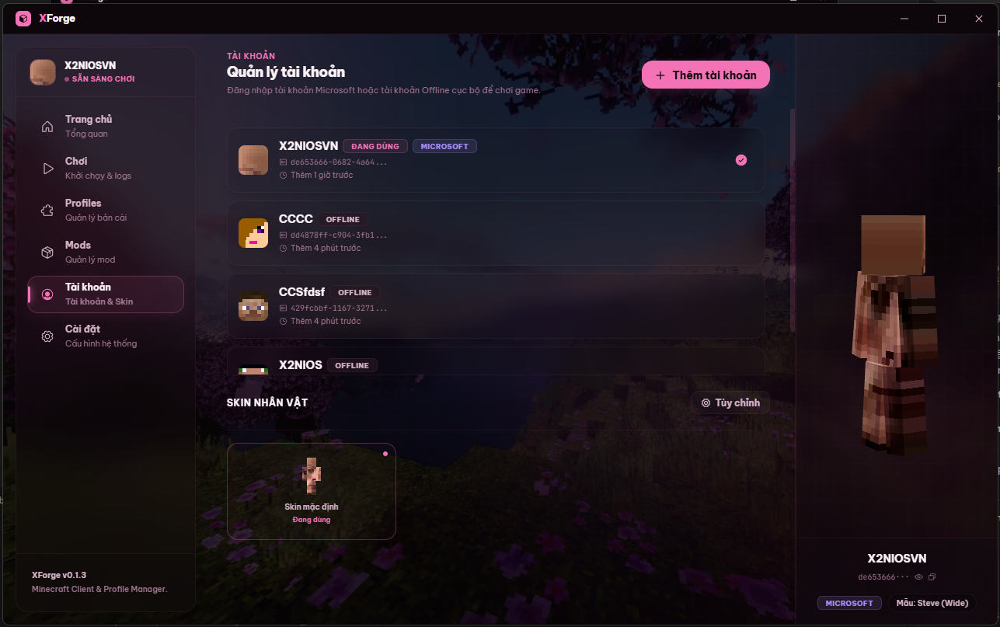
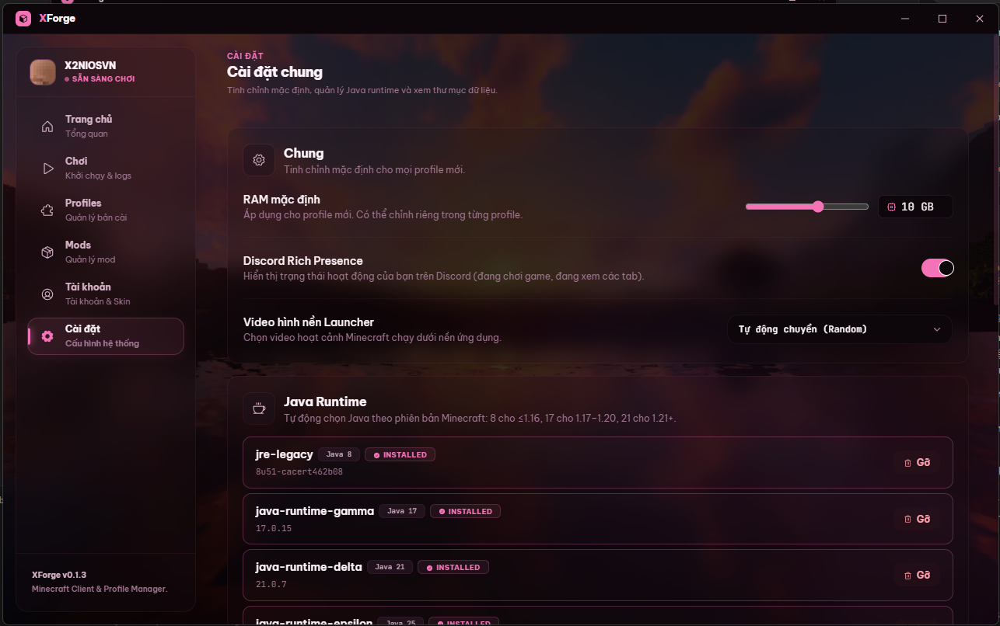

# XForge - Minecraft Client & Profile Manager

<p align="center">
  
</p>

<p align="center">
  Trình quản lý và khởi chạy Minecraft (Launcher) tối giản, hiện đại xây dựng trên Electron + React. Hỗ trợ giao diện kính mờ (Glassmorphism), hình nền video động, xác thực Microsoft chính thức và quản lý Java Runtime tự động.
</p>

---

## Trải nghiệm Giao diện (Screenshots)

<p align="center">
  
  
</p>
<p align="center">
  
  
</p>
<p align="center">
  
  
</p>

---

## Tính năng chính

- **Giao diện Glassmorphism & Video Background:** Thiết kế giao diện xuyên thấu với hoạt cảnh video động dưới nền. Hỗ trợ cơ chế tự động chuyển ngẫu nhiên video khi mở hoặc chuyển tiếp.
- **Quản lý Profile:** Tạo, sửa đổi và khởi chạy các bản cài Minecraft độc lập. Tự động tải client jar, assets và libraries trực tiếp từ Mojang.
- **Hỗ trợ Mod Loader:** Tự động tải và chạy bộ cài đặt cho Vanilla, Forge, Fabric, NeoForge và OptiFine.
- **Tự động cài đặt Java:** Quét phiên bản game và tự động tải JRE Mojang tương thích (Java 8, 17, 21, 25) về máy cục bộ.
- **Tích hợp tìm kiếm Modpack & Mods:** Tải trực tiếp Mod, Modpack, Resource Pack từ Modrinth và CurseForge về instance.
- **Xác thực Microsoft:** Hỗ trợ đăng nhập tài khoản Microsoft (OAuth2, tự động làm mới token) hoặc tài khoản Offline. Tích hợp hiển thị skin 3D tương tác.
- **Discord Rich Presence & Live Logs:** Hiển thị trạng thái chơi game trực tiếp trên Discord. Tích hợp trình xem logs trực tiếp phân loại màu sắc và tìm kiếm.

---

## Công nghệ sử dụng

- **Frontend:** React 19, Vite 8, JavaScript
- **Styling:** Vanilla CSS, Tailwind CSS 4
- **Icons:** Phosphor Icons
- **Core:** Electron 42 (Frameless window, IPC communication)
- **3D Render:** Three.js / React Three Fiber (Mô phỏng nhân vật Minecraft)

---

## Hướng dẫn phát triển & Đóng gói

### 1. Cài đặt dependencies
```bash
npm install
```

### 2. Chạy môi trường phát triển (Development)
```bash
npm run electron:dev
```

### 3. Biên dịch và Đóng gói (Production Build)
- Đóng gói installer Setup.exe và bản Portable cho Windows:
  - Bằng Command Prompt:
    ```cmd
    npm run electron:build
    ```
  - Bằng PowerShell:
    ```powershell
    cmd /c "npm run electron:build"
    ```

---

## Tác giả (Author)

[x2niosvn](https://github.com/x2niosvn)
